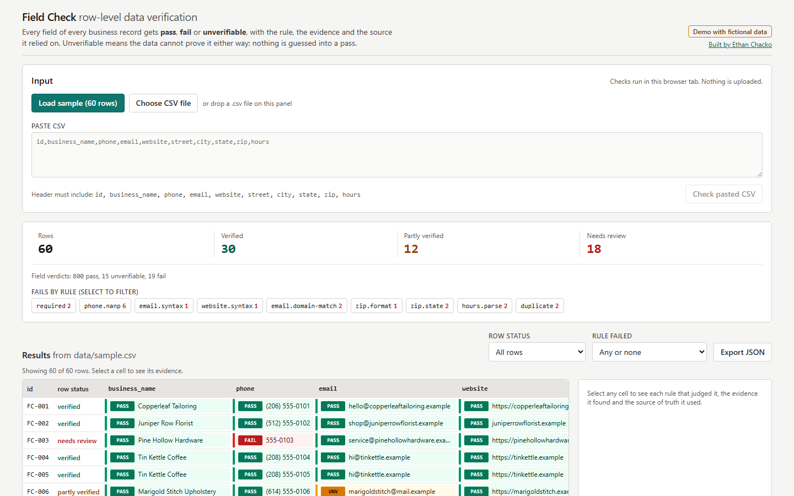

# Field Check: row-level data verification

Checks every field of a business directory CSV and returns pass, fail or unverifiable for each one, with the rule id, the evidence found and the source of truth the rule relied on.

**Live demo:** https://field-check-psi.vercel.app (fictional data)



## What this demonstrates

- One pure TypeScript rule engine (`src/core/`) shared by a Node CLI and a React browser UI, with no DOM or Node APIs inside the core. Both typecheck configs compile it, which enforces this.
- Honest three-state verdicts. "Unverifiable" is a first-class result for data that cannot prove pass or fail offline, such as a free-mail address, a blank optional field or a ZIP prefix outside the reference table. Nothing is guessed into a pass.
- Every verdict names its source (numbering plan, USPS prefix table, grammar file). An invariant test fails the build if any verdict lacks one.
- Real validation logic, not regexes alone: NANP area code and exchange rules, a ZIP prefix to state table covering all 50 states and DC, an hours grammar that parses into a weekly schedule, and near-duplicate detection on normalized name plus phone.
- A golden test pins the exact summary counts and every row's status for the seeded sample, so any rule change that moves a number is caught.

## Live demo

Live demo: https://field-check-psi.vercel.app

## Run it

```
npm install
npm run dev          # web UI at http://localhost:5173
npm test             # 74 tests
npm run typecheck
npm run build
npm run check -- data/sample.csv --out out/   # CLI: writes out/results.json and out/results.csv
```

Requires Node 22 or later. Everything runs offline.

## How it works

```
CSV text
  -> src/core/csv.ts          RFC 4180 parser, header mapped by column name
  -> src/core/engine.ts       runs every rule per row, then the dataset-level duplicate rule
       src/core/rules/required.ts     required fields present; blank optional -> unverifiable
       src/core/rules/phone.ts        normalize, then NANP area code and exchange rules; 555-0100..0199 passes as fictional
       src/core/rules/email.ts        address syntax
       src/core/rules/website.ts      URL syntax and host labels
       src/core/rules/domainMatch.ts  email domain vs website domain; free-mail -> unverifiable
       src/core/rules/zip.ts          ZIP format, then prefix-to-state via data/zip3-state.json
       src/core/rules/hours.ts        hours grammar -> weekly schedule
       src/core/rules/duplicate.ts    normalized name + phone, flagged on every row in the group
  -> RunResult { rows: [{ verdicts, counts, status }], summary }
  -> src/core/export.ts       results.json, results.csv (one line per verdict), text summary
       used by cli/check.ts (Node, via tsx) and src/App.tsx (browser)
```

A verdict is `{ field, status, ruleId, message, evidence, source }`. Rules return `null` when they do not apply (for example, the email syntax rule on a blank email), so each finding is reported once. Sources come from one table, `src/core/sources.ts`, and are attached by a single constructor, `verdict()`, so no rule can emit a verdict without one.

Row status: any fail means "needs review", all pass means "verified", anything else means "partly verified". A table cell takes the worst status of its verdicts. The evidence panel lists every verdict for that cell.

Sample summary (`npm run check -- data/sample.csv --out out/`): 60 rows, 30 verified, 12 partly verified, 18 need review. There are 834 verdicts: 800 pass, 15 unverifiable, 19 fail.

### Sample data: fictional numbers and mailboxes only

Every phone number and email address in the sample, the tests and this README is fictional by construction, so the public demo cannot show a real person's contact details:

- Phone numbers use 555-0100 to 555-0199, the range NANPA reserves for fictional use, in any area code. The phone rule passes that range and says so in the verdict message ("the range reserved for fictional use"). An earlier version failed that range as "cannot be a real listing"; that made sense for production data but meant a safe sample could never pass.
- The six phone failures are real defects seeded on purpose, each built around a 555-01xx line: `555-0103` (7 digits, FC-003), `(411) 555-0107` (N11 area code, FC-007), `(614) 555-PIPE` (letters, FC-012), `(050) 555-0115` (area code starting with 0, FC-015), `(123) 555-0128` (area code starting with 1, FC-028) and `515-555-016` (9 digits, FC-060). FC-012 previously carried an N11 exchange and FC-015 the fictional range itself; an exchange defect cannot sit inside 555-01xx, so exchange rules are covered by unit tests instead of sample rows.
- The near-duplicate pair keeps one shared number in two formats (`(503) 555-0109` and `503.555.0109`), and the two Tin Kettle Coffee branches keep different numbers, so the duplicate rule still has a true pair and a true non-pair.
- Business email addresses use the same reserved `.example` domain as the business website, so the domain-match rule can pass or fail on them.
- The free-mail rows (FC-006, FC-016, FC-032, FC-053) use `mail.example` and `inbox.example`, fictional free-mail providers listed in `src/core/reference/freemail.ts` and named in the rule's source. Real webmail providers stay on the same list and are matched the same way on production data; the sample just never contains a real mailbox.
- Because each old defect was replaced by a defect of the same weight, the golden counts did not move: 30 verified, 12 partly verified, 18 need review, 6 phone fails.

## Tests

74 Vitest tests in `tests/`:

- Per rule: pass, fail and unverifiable (or not-applicable) cases for required, phone, email, website, domain match, ZIP format, ZIP to state, hours and duplicates.
- CSV parsing: quoting, embedded newlines, CRLF, byte order mark, missing columns, round trip.
- ZIP table integrity: covers all 50 states and DC; ranges are sorted and do not overlap.
- Golden: the full pipeline on `data/sample.csv` asserts the exact summary, the per-rule fail counts and the status of each of the 60 rows.
- Invariants: every verdict has a known rule id, a valid status and a non-empty source, message and evidence; every field of every row gets at least one verdict; row counts agree with the row status rule.
- Exports: the CSV has one line per verdict, each with a source; the JSON carries the summary and all rows.

## Limitations and honest notes

- Offline by design. A "pass" on phone, email or website means the value is well formed. It does not mean the line is in service, the mailbox exists or the site is reachable. The verdict messages say so.
- The ZIP table works at prefix-range granularity. Unassigned prefixes inside a range count toward that range's state, and a few prefixes that USPS shares between areas are simplified. Prefixes outside every range return unverifiable. A ZIP that matches its state can still be wrong for the city; city-level checks would need the full 5-digit ZIP file.
- Domain matching compares the last two host labels. That is right for the US `.com`/`.net`/`.example` style domains in scope, but not for multi-part public suffixes such as `co.uk`. A full solution would use the Public Suffix List.
- Duplicate detection needs an exact match on the normalized name and phone. It does not catch typos in names ("Harbour" vs "Harbor") or the same business listed under two different phones.
- The hours grammar covers common directory formats (`Mon-Fri 9:00-17:00; Sat 10am-2pm; Sun closed`, `Daily ...`, split shifts, overnight). Bare numbers such as `9-5` fail as ambiguous rather than being guessed.
- The browser UI handles files up to 5 MB and renders every matching row. It does not virtualize very large tables.

## Data notice

All business records in `data/sample.csv` are fictional. The names were invented, and websites and email domains use the reserved `.example` top-level domain (RFC 2606), including the fictional free-mail providers `mail.example` and `inbox.example`. Every phone number is in the 555-0100 to 555-0199 range reserved for fictional use. Street addresses were made up to look realistic and are not intended to match any real business. City and state names are real US places, used so the ZIP check has something true to test against.

Public reference data:

- `data/zip3-state.json` was compiled at prefix-range granularity from the USPS three-digit ZIP Code prefix assignments (USPS Publication 65, National Five-Digit ZIP Code and Post Office Directory). USPS publications are works of the US government and are not subject to copyright in the United States.
- Phone rules follow the North American Numbering Plan as published by the NANP Administrator (nationalnanpa.com): N11 service codes, area codes starting 2 through 9, middle digit 9 reserved for expansion, and 555-0100 through 555-0199 reserved for fictional use (passed, and labelled as fictional).

Code is MIT licensed; see `LICENSE`.
